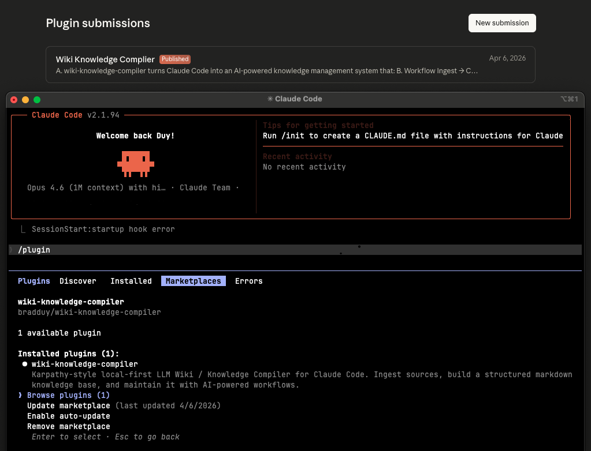

<p align="center">
  
</p>

<h1 align="center">Wiki Knowledge Compiler</h1>

<p align="center">
  <em>Turn your documents into a personal knowledge base — powered by AI, stored as simple files.</em>
</p>

<p align="center">
  <a href="https://github.com/bradduy/wiki-knowledge-compiler/blob/main/LICENSE"></a>
  <a href="https://github.com/bradduy/wiki-knowledge-compiler"></a>
  <a href="https://obsidian.md"></a>
  
</p>

<p align="center">
  
</p>

<p align="center">
  <a href="#-english">🇬🇧 English</a> &nbsp;·&nbsp;
  <a href="#-tiếng-việt">🇻🇳 Tiếng Việt</a> &nbsp;·&nbsp;
  <a href="#-简体中文">🇨🇳 简体中文</a> &nbsp;·&nbsp;
  <a href="#-한국어">🇰🇷 한국어</a> &nbsp;·&nbsp;
  <a href="#-日本語">🇯🇵 日本語</a> &nbsp;·&nbsp;
  <a href="#-deutsch">🇩🇪 Deutsch</a> &nbsp;·&nbsp;
  <a href="#-français">🇫🇷 Français</a> &nbsp;·&nbsp;
  <a href="#-русский">🇷🇺 Русский</a>
</p>

---

# 🇬🇧 English

## 📖 What is this?

A plugin for [Claude Code](https://docs.anthropic.com/en/docs/claude-code) that turns your documents into an organized, searchable knowledge base.

Give it anything — articles, notes, PDFs, a whole folder — and it will:

1. 💾 **Save** your originals (they're never changed)
2. 📝 **Summarize** each source
3. 💡 **Extract** key ideas into their own pages
4. 🔗 **Connect** related ideas across everything you've added
5. 💬 **Answer** your questions with links back to the sources

Everything stays on your computer as plain text files. No cloud. No database. No lock-in.

---

## 🚀 Quick Start

Three steps. Everything installs automatically — you don't need to set up anything yourself.

**Step 1 — Install the plugin:**
```
/plugin marketplace add bradduy/wiki-knowledge-compiler
```
Then go to `/plugin` → select the **wiki-knowledge-compiler** marketplace → choose the plugin → **enable scope**. This grants the plugin permission to run on your machine — the `/wiki-` commands will appear after this step.

**Step 2 — Run setup:**
```
/wiki-setup
```
Pick your project size (small, medium, or large). The plugin handles the rest — it installs any tools you need, builds your wiki folder, and even offers to set up [Obsidian](https://obsidian.md) so you can browse your wiki visually.

**Step 3 — Add your first document:**
```
/wiki-ingest ~/Documents/my-article.md
```

Done. Your wiki is live.

---

## 🎯 What You Can Do

Each command tells you what to try next, so you always know the next step.

| Command | What it does |
|---------|-------------|
| `/wiki-setup` | ⚙️ One-time setup (installs everything for you) |
| `/wiki-ingest` | 📥 Add documents — one file, a whole folder, or a URL |
| `/wiki-query` | 🔍 Ask a question, get an answer with sources |
| `/wiki-insights` | ✨ Find patterns and connections across your sources |
| `/wiki-health` | 🩺 Find and fix problems (duplicates, broken links) |
| `/wiki-update` | 🔄 Refresh the table of contents |

**Recommended order:** `/wiki-setup` → `/wiki-ingest` → `/wiki-query` → `/wiki-insights` → `/wiki-health` → `/wiki-update`

---

## 📥 Adding Documents

You can add documents in many ways:

```bash
# One file
/wiki-ingest ~/Documents/article.md

# A whole folder (scans everything inside)
/wiki-ingest ~/Documents/research/

# Multiple files at once
/wiki-ingest ~/notes/meeting1.md ~/notes/meeting2.md

# All PDFs in a folder
/wiki-ingest ~/papers/*.pdf

# A URL
/wiki-ingest https://example.com/interesting-article

# Or just paste text directly after the command
```

For folders and multiple files, the plugin shows progress as it works through each one.

---

## 🧪 Example: From Document to Knowledge

Say you add an article about climate change:

```
/wiki-ingest ~/Articles/ipcc-summary-2023.md
```

The plugin creates:

| What | Description |
|------|------------|
| **Summary** | A one-page overview of the article |
| **Concepts** | Pages for key ideas like "carbon budget" and "tipping points" |
| **Topic page** | A "climate science" page linking everything together |

Now add a second article about energy policy. The plugin notices both sources discuss carbon budgets and links them automatically.

When you ask:
```
/wiki-query How do carbon budgets affect energy policy?
```

You get an answer that draws from **both** sources, with links to exactly where each fact came from.

---

## 🔮 Browse Your Wiki with Obsidian

During setup, you'll be asked if you want [Obsidian](https://obsidian.md) — a free app for browsing your wiki visually. It's installed automatically if you say yes.

Open your `knowledge-base/` folder in Obsidian and you get:

- 🕸️ **Graph View** — a visual map of all your pages and how they connect
- 🔙 **Backlinks** — click any page to see everything that links to it
- 🔍 **Search** — find anything across your entire wiki
- ⚡ **Live sync** — new pages from `/wiki-ingest` appear in Obsidian right away

This is optional. Your wiki works perfectly with just the commands.

---

## 📁 What Gets Created

```
knowledge-base/
  📄 raw/           Your original documents (never modified)
  📋 summaries/     One-page summary of each source
  💡 concepts/      Key ideas, one per page
  📚 topics/        Bigger-picture pages grouping related ideas
  ✨ insights/      Connections discovered across sources
  📇 index/         Table of contents (auto-generated)
  🔗 references/    Links to external resources
  📝 log.md         A record of everything that happened
```

All files are plain Markdown. Open them with any text editor, Obsidian, or VS Code.

---

## 💡 Tips

- 🌱 **Start small.** Add 2–3 sources and try `/wiki-query` before adding more.
- 🎯 **Be specific.** "What does source X say about Y?" works better than vague questions.
- 🩺 **Run `/wiki-health` occasionally.** It keeps things tidy as your wiki grows.
- ✨ **Try `/wiki-insights`** after adding several sources on a topic — it finds patterns you might miss.
- 🔒 **Your sources are safe.** The plugin never changes your original files.

---

## ⚙️ How Setup Works

`/wiki-setup` handles everything automatically based on your project size:

| Size | Search | What gets installed |
|------|--------|-------------------|
| **Small** | Built-in | Nothing extra needed |
| **Medium** | Smart search ([qmd](https://github.com/tobi/qmd)) | Node.js + qmd (auto-installed) |
| **Large** | Fastest search | Node.js + qmd + MCP server (auto-installed and configured) |

The plugin detects your operating system (macOS, Linux, Windows) and installs everything using the right method for your machine. If anything fails, it falls back to built-in search — you're never stuck.

---

## 📦 Other Ways to Install

### From the Claude Code Marketplace (easiest)

```
/plugin marketplace add bradduy/wiki-knowledge-compiler
```
Then go to `/plugin` → select the **wiki-knowledge-compiler** marketplace → choose the plugin → **enable scope**. This grants the plugin permission to run on your machine — the `/wiki-` commands will appear after this step.

### Clone as a standalone project

```bash
git clone https://github.com/bradduy/wiki-knowledge-compiler.git
cd wiki-knowledge-compiler
```

Open in Claude Code and run `/wiki-setup`.

### Add to an existing project

```bash
git clone https://github.com/bradduy/wiki-knowledge-compiler.git /tmp/wkc
cp -r /tmp/wkc/.claude/ your-project/.claude/
cp -r /tmp/wkc/.claude-plugin/ your-project/.claude-plugin/
cp -r /tmp/wkc/{agents,skills,templates} your-project/
cp /tmp/wkc/CLAUDE.md your-project/CLAUDE.md
cp /tmp/wkc/wiki.config.md your-project/wiki.config.md
bash /tmp/wkc/scripts/init-kb.sh your-project/knowledge-base
rm -rf /tmp/wkc
```

Then run `/wiki-setup`.

---

## 📌 Good to Know

- 📡 **Works offline.** Everything is on your computer.
- 📄 **Plain text files.** No database or special software needed to read your wiki.
- 📑 **PDFs supported.** Complex layouts (tables, multi-column) may not extract perfectly.
- 👤 **Designed for personal use.** Single user.
- 🕐 **Want version history?** Run `git init` in your knowledge base folder.

---

## 🤝 Contributing

Want to improve the plugin? See the [contributing guide](.github/CONTRIBUTING.md) or open an issue.

## 📄 License

MIT

---

# 🇻🇳 Tiếng Việt

## 📖 Đây là gì?

Một plugin cho [Claude Code](https://docs.anthropic.com/en/docs/claude-code) giúp biến tài liệu của bạn thành một kho kiến thức có tổ chức, dễ tìm kiếm.

Đưa cho nó bất cứ thứ gì — bài viết, ghi chú, PDF, cả một thư mục — và nó sẽ:

1. **Lưu trữ** bản gốc của bạn (không bao giờ bị thay đổi)
2. **Tóm tắt** từng nguồn tài liệu
3. **Trích xuất** các ý tưởng chính thành từng trang riêng
4. **Kết nối** các ý tưởng liên quan xuyên suốt mọi thứ bạn đã thêm
5. **Trả lời** câu hỏi của bạn kèm liên kết về nguồn gốc

Mọi thứ nằm trên máy tính của bạn dưới dạng file văn bản thuần. Không cloud. Không database. Không bị phụ thuộc.

---

## 🚀 Bắt đầu nhanh

Ba bước. Mọi thứ được cài đặt tự động — bạn không cần tự thiết lập gì cả.

**Bước 1 — Cài plugin:**
```
/plugin marketplace add bradduy/wiki-knowledge-compiler
```
Sau đó vào `/plugin` → chọn marketplace **wiki-knowledge-compiler** → chọn plugin → **bật scope**. Bước này cấp quyền cho plugin chạy trên máy bạn — các lệnh `/wiki-` sẽ xuất hiện sau khi bật.

**Bước 2 — Chạy thiết lập:**
```
/wiki-setup
```
Chọn quy mô dự án (nhỏ, vừa, hoặc lớn). Plugin lo phần còn lại — cài các công cụ cần thiết, tạo thư mục wiki, và còn đề nghị cài [Obsidian](https://obsidian.md) để bạn duyệt wiki trực quan.

**Bước 3 — Thêm tài liệu đầu tiên:**
```
/wiki-ingest ~/Documents/my-article.md
```

Xong. Wiki của bạn đã sẵn sàng.

---

## 🎯 Bạn có thể làm gì

Mỗi lệnh sẽ gợi ý bước tiếp theo, nên bạn luôn biết phải làm gì.

| Lệnh | Chức năng |
|---------|-------------|
| `/wiki-setup` | Thiết lập một lần (tự cài đặt mọi thứ cho bạn) |
| `/wiki-ingest` | Thêm tài liệu — một file, cả thư mục, hoặc một URL |
| `/wiki-query` | Đặt câu hỏi, nhận câu trả lời kèm nguồn |
| `/wiki-insights` | Tìm các mẫu hình và mối liên hệ giữa các nguồn |
| `/wiki-health` | Tìm và sửa lỗi (trùng lặp, liên kết hỏng) |
| `/wiki-update` | Cập nhật mục lục |

**Thứ tự khuyên dùng:** `/wiki-setup` → `/wiki-ingest` → `/wiki-query` → `/wiki-insights` → `/wiki-health` → `/wiki-update`

---

## 📥 Thêm tài liệu

Bạn có thể thêm tài liệu bằng nhiều cách:

```bash
# Một file
/wiki-ingest ~/Documents/article.md

# Cả một thư mục (quét toàn bộ bên trong)
/wiki-ingest ~/Documents/research/

# Nhiều file cùng lúc
/wiki-ingest ~/notes/meeting1.md ~/notes/meeting2.md

# Tất cả PDF trong một thư mục
/wiki-ingest ~/papers/*.pdf

# Một URL
/wiki-ingest https://example.com/interesting-article

# Hoặc dán trực tiếp nội dung sau lệnh
```

Với thư mục và nhiều file, plugin sẽ hiển thị tiến trình khi xử lý từng file.

---

## 🧪 Ví dụ: Từ tài liệu đến kiến thức

Giả sử bạn thêm một bài viết về biến đổi khí hậu:

```
/wiki-ingest ~/Articles/ipcc-summary-2023.md
```

Plugin sẽ tạo ra:

| Nội dung | Mô tả |
|------|------------|
| **Tóm tắt** | Tổng quan một trang về bài viết |
| **Khái niệm** | Các trang cho ý tưởng chính như "ngân sách carbon" và "điểm tới hạn" |
| **Trang chủ đề** | Trang "khoa học khí hậu" liên kết mọi thứ lại với nhau |

Bây giờ thêm một bài viết thứ hai về chính sách năng lượng. Plugin nhận ra cả hai nguồn đều đề cập đến ngân sách carbon và tự động liên kết chúng.

Khi bạn hỏi:
```
/wiki-query How do carbon budgets affect energy policy?
```

Bạn nhận được câu trả lời rút ra từ **cả hai** nguồn, kèm liên kết đến chính xác nơi mỗi thông tin được lấy ra.

---

## 🔮 Duyệt wiki bằng Obsidian

Trong quá trình thiết lập, bạn sẽ được hỏi có muốn dùng [Obsidian](https://obsidian.md) không — một ứng dụng miễn phí để duyệt wiki trực quan. Nó được cài tự động nếu bạn đồng ý.

Mở thư mục `knowledge-base/` trong Obsidian và bạn có:

- **Graph View** — bản đồ trực quan tất cả các trang và cách chúng kết nối
- **Backlinks** — nhấn vào bất kỳ trang nào để xem mọi thứ liên kết đến nó
- **Search** — tìm bất cứ thứ gì trong toàn bộ wiki
- **Đồng bộ trực tiếp** — các trang mới từ `/wiki-ingest` hiện ngay trong Obsidian

Đây là tùy chọn. Wiki của bạn hoạt động hoàn toàn tốt chỉ với các lệnh.

---

## 📁 Những gì được tạo ra

```
knowledge-base/
  raw/           Tài liệu gốc của bạn (không bao giờ bị sửa đổi)
  summaries/     Tóm tắt một trang cho mỗi nguồn
  concepts/      Ý tưởng chính, mỗi ý một trang
  topics/        Các trang tổng quan nhóm các ý tưởng liên quan
  insights/      Mối liên hệ phát hiện được giữa các nguồn
  index/         Mục lục (tự động tạo)
  references/    Liên kết đến tài nguyên bên ngoài
  log.md         Nhật ký mọi hoạt động đã diễn ra
```

Tất cả file đều là Markdown thuần. Mở bằng bất kỳ trình soạn thảo nào, Obsidian, hoặc VS Code.

---

## 💡 Mẹo hay

- **Bắt đầu nhỏ.** Thêm 2–3 nguồn và thử `/wiki-query` trước khi thêm nhiều hơn.
- **Hỏi cụ thể.** "Nguồn X nói gì về Y?" hiệu quả hơn câu hỏi chung chung.
- **Chạy `/wiki-health` thỉnh thoảng.** Giúp mọi thứ gọn gàng khi wiki phát triển.
- **Thử `/wiki-insights`** sau khi thêm nhiều nguồn về cùng một chủ đề — nó tìm ra các mẫu hình bạn có thể bỏ lỡ.
- **Nguồn của bạn luôn an toàn.** Plugin không bao giờ thay đổi file gốc của bạn.

---

## ⚙️ Cách thiết lập hoạt động

`/wiki-setup` tự động xử lý mọi thứ dựa trên quy mô dự án của bạn:

| Quy mô | Tìm kiếm | Những gì được cài đặt |
|------|--------|-------------------|
| **Nhỏ** | Tích hợp sẵn | Không cần thêm gì |
| **Vừa** | Tìm kiếm thông minh ([qmd](https://github.com/tobi/qmd)) | Node.js + qmd (tự động cài) |
| **Lớn** | Tìm kiếm nhanh nhất | Node.js + qmd + MCP server (tự động cài và cấu hình) |

Plugin nhận diện hệ điều hành của bạn (macOS, Linux, Windows) và cài đặt mọi thứ bằng phương pháp phù hợp. Nếu có lỗi xảy ra, nó tự chuyển về tìm kiếm tích hợp sẵn — bạn không bao giờ bị kẹt.

---

## 📦 Các cách cài đặt khác

### Từ Claude Code Marketplace (dễ nhất)

```
/plugin marketplace add bradduy/wiki-knowledge-compiler
```
Sau đó vào `/plugin` → chọn marketplace **wiki-knowledge-compiler** → chọn plugin → **bật scope**. Bước này cấp quyền cho plugin chạy trên máy bạn — các lệnh `/wiki-` sẽ xuất hiện sau khi bật.

### Clone như một dự án độc lập

```bash
git clone https://github.com/bradduy/wiki-knowledge-compiler.git
cd wiki-knowledge-compiler
```

Mở trong Claude Code và chạy `/wiki-setup`.

### Thêm vào dự án hiện có

```bash
git clone https://github.com/bradduy/wiki-knowledge-compiler.git /tmp/wkc
cp -r /tmp/wkc/.claude/ your-project/.claude/
cp -r /tmp/wkc/.claude-plugin/ your-project/.claude-plugin/
cp -r /tmp/wkc/{agents,skills,templates} your-project/
cp /tmp/wkc/CLAUDE.md your-project/CLAUDE.md
cp /tmp/wkc/wiki.config.md your-project/wiki.config.md
bash /tmp/wkc/scripts/init-kb.sh your-project/knowledge-base
rm -rf /tmp/wkc
```

Sau đó chạy `/wiki-setup`.

---

## 📌 Lưu ý thêm

- **Hoạt động offline.** Mọi thứ nằm trên máy tính của bạn.
- **File văn bản thuần.** Không cần database hay phần mềm đặc biệt để đọc wiki.
- **Hỗ trợ PDF.** Bố cục phức tạp (bảng, nhiều cột) có thể không trích xuất hoàn hảo.
- **Thiết kế cho cá nhân.** Một người dùng.
- **Muốn lưu lịch sử phiên bản?** Chạy `git init` trong thư mục knowledge base.

---

## 🤝 Đóng góp

Muốn cải thiện plugin? Xem [hướng dẫn đóng góp](.github/CONTRIBUTING.md) hoặc tạo issue.

## 📄 Giấy phép

MIT

---

# 🇨🇳 简体中文

## 📖 这是什么？

一个 [Claude Code](https://docs.anthropic.com/en/docs/claude-code) 插件，能将你的文档转化为有组织、可搜索的知识库。

你可以输入任何内容——文章、笔记、PDF、整个文件夹——它会：

1. **保存**你的原始文件（绝不修改）
2. **总结**每个来源
3. **提取**关键概念，生成独立页面
4. **关联**你所添加的所有内容中的相关概念
5. **回答**你的问题，并附上来源链接

所有内容以纯文本文件保存在你的电脑上。无需云端，无需数据库，不会被锁定。

---

## 🚀 快速开始

三个步骤。一切自动安装——你无需手动配置任何东西。

**第 1 步——安装插件：**
```
/plugin marketplace add bradduy/wiki-knowledge-compiler
```
然后进入 `/plugin` → 选择 **wiki-knowledge-compiler** 市场 → 选择该插件 → **启用 scope**。此步骤授权插件在你的机器上运行——启用后 `/wiki-` 命令将会出现。

**第 2 步——运行设置：**
```
/wiki-setup
```
选择你的项目规模（小型、中型或大型）。插件会处理剩下的一切——安装所需工具、创建 wiki 文件夹，还可以帮你配置 [Obsidian](https://obsidian.md)，让你以可视化方式浏览知识库。

**第 3 步——添加你的第一个文档：**
```
/wiki-ingest ~/Documents/my-article.md
```

完成。你的知识库已上线。

---

## 🎯 你可以做什么

每个命令都会提示你下一步该做什么，你始终知道接下来的操作。

| 命令 | 功能 |
|---------|-------------|
| `/wiki-setup` | 一次性设置（自动安装所有依赖） |
| `/wiki-ingest` | 添加文档——单个文件、整个文件夹或 URL |
| `/wiki-query` | 提问并获得附带来源的回答 |
| `/wiki-insights` | 发现来源之间的模式和关联 |
| `/wiki-health` | 查找并修复问题（重复项、失效链接） |
| `/wiki-update` | 刷新目录 |

**推荐顺序：** `/wiki-setup` → `/wiki-ingest` → `/wiki-query` → `/wiki-insights` → `/wiki-health` → `/wiki-update`

---

## 📥 添加文档

你可以通过多种方式添加文档：

```bash
# 单个文件
/wiki-ingest ~/Documents/article.md

# 整个文件夹（扫描其中所有内容）
/wiki-ingest ~/Documents/research/

# 同时添加多个文件
/wiki-ingest ~/notes/meeting1.md ~/notes/meeting2.md

# 文件夹中的所有 PDF
/wiki-ingest ~/papers/*.pdf

# 一个 URL
/wiki-ingest https://example.com/interesting-article

# 或者直接在命令后粘贴文本
```

对于文件夹和多个文件，插件会显示逐个处理的进度。

---

## 🧪 示例：从文档到知识

假设你添加了一篇关于气候变化的文章：

```
/wiki-ingest ~/Articles/ipcc-summary-2023.md
```

插件会创建：

| 内容 | 说明 |
|------|------------|
| **摘要** | 文章的单页概览 |
| **概念** | 关键概念的独立页面，如"碳预算"和"临界点" |
| **主题页** | 一个"气候科学"页面，将所有内容串联起来 |

现在添加第二篇关于能源政策的文章。插件会发现两个来源都讨论了碳预算，并自动建立关联。

当你提问：
```
/wiki-query How do carbon budgets affect energy policy?
```

你会得到一个综合**两个**来源的回答，并附有每个事实的精确出处链接。

---

## 🔮 用 Obsidian 浏览你的知识库

在设置过程中，你会被问到是否需要 [Obsidian](https://obsidian.md)——一个免费的知识库可视化浏览工具。如果你选择安装，它会自动完成。

在 Obsidian 中打开你的 `knowledge-base/` 文件夹，你会获得：

- **图谱视图** — 所有页面及其关联的可视化地图
- **反向链接** — 点击任意页面查看所有链接到它的内容
- **搜索** — 在整个知识库中查找任何内容
- **实时同步** — 通过 `/wiki-ingest` 新增的页面会立即出现在 Obsidian 中

这是可选的。仅使用命令行，你的知识库也能完美运行。

---

## 📁 创建的内容结构

```
knowledge-base/
  raw/           你的原始文档（从不修改）
  summaries/     每个来源的单页摘要
  concepts/      关键概念，每个概念一页
  topics/        更宏观的主题页，归类相关概念
  insights/      跨来源发现的关联
  index/         目录（自动生成）
  references/    外部资源链接
  log.md         所有操作的记录
```

所有文件均为纯 Markdown 格式。可以用任意文本编辑器、Obsidian 或 VS Code 打开。

---

## 💡 使用建议

- **从小处开始。** 先添加 2–3 个来源，试试 `/wiki-query`，然后再添加更多。
- **提问要具体。** "来源 X 关于 Y 说了什么？"比模糊的问题效果更好。
- **定期运行 `/wiki-health`。** 随着知识库增长，它能帮你保持整洁。
- **添加多个同主题来源后试试 `/wiki-insights`** ——它能发现你可能忽略的模式。
- **你的原始文件是安全的。** 插件绝不会修改你的原始文件。

---

## ⚙️ 设置工作原理

`/wiki-setup` 会根据你的项目规模自动处理所有配置：

| 规模 | 搜索方式 | 安装内容 |
|------|--------|-------------------|
| **小型** | 内置搜索 | 无需额外安装 |
| **中型** | 智能搜索（[qmd](https://github.com/tobi/qmd)） | Node.js + qmd（自动安装） |
| **大型** | 最快搜索 | Node.js + qmd + MCP 服务器（自动安装和配置） |

插件会检测你的操作系统（macOS、Linux、Windows），并使用适合你机器的方式安装所有依赖。如果安装失败，会自动回退到内置搜索——你永远不会卡住。

---

## 📦 其他安装方式

### 从 Claude Code 市场安装（最简单）

```
/plugin marketplace add bradduy/wiki-knowledge-compiler
```
然后进入 `/plugin` → 选择 **wiki-knowledge-compiler** 市场 → 选择该插件 → **启用 scope**。此步骤授权插件在你的机器上运行——启用后 `/wiki-` 命令将会出现。

### 克隆为独立项目

```bash
git clone https://github.com/bradduy/wiki-knowledge-compiler.git
cd wiki-knowledge-compiler
```

在 Claude Code 中打开并运行 `/wiki-setup`。

### 添加到现有项目

```bash
git clone https://github.com/bradduy/wiki-knowledge-compiler.git /tmp/wkc
cp -r /tmp/wkc/.claude/ your-project/.claude/
cp -r /tmp/wkc/.claude-plugin/ your-project/.claude-plugin/
cp -r /tmp/wkc/{agents,skills,templates} your-project/
cp /tmp/wkc/CLAUDE.md your-project/CLAUDE.md
cp /tmp/wkc/wiki.config.md your-project/wiki.config.md
bash /tmp/wkc/scripts/init-kb.sh your-project/knowledge-base
rm -rf /tmp/wkc
```

然后运行 `/wiki-setup`。

---

## 📌 其他须知

- **支持离线使用。** 所有内容都在你的电脑上。
- **纯文本文件。** 无需数据库或特殊软件即可阅读你的知识库。
- **支持 PDF。** 复杂排版（表格、多栏）可能无法完美提取。
- **为个人使用设计。** 单用户。
- **想要版本历史？** 在知识库文件夹中运行 `git init`。

---

## 🤝 参与贡献

想改进这个插件？请参阅[贡献指南](.github/CONTRIBUTING.md)或提交 issue。

## 📄 许可证

MIT

---

# 🇰🇷 한국어

## 📖 이것은 무엇인가요?

[Claude Code](https://docs.anthropic.com/en/docs/claude-code)용 플러그인으로, 문서를 체계적이고 검색 가능한 지식 베이스로 변환합니다.

어떤 것이든 넣을 수 있습니다 — 기사, 노트, PDF, 폴더 전체 — 플러그인이 다음을 수행합니다:

1. **저장** 원본 파일을 보존합니다 (절대 변경하지 않음)
2. **요약** 각 출처를 요약합니다
3. **추출** 핵심 아이디어를 별도 페이지로 만듭니다
4. **연결** 추가한 모든 자료에서 관련 아이디어를 연결합니다
5. **답변** 출처 링크와 함께 질문에 답합니다

모든 것이 일반 텍스트 파일로 컴퓨터에 저장됩니다. 클라우드 없음. 데이터베이스 없음. 종속성 없음.

---

## 🚀 빠른 시작

세 단계. 모든 것이 자동으로 설치됩니다 — 직접 설정할 필요가 없습니다.

**1단계 — 플러그인 설치:**
```
/plugin marketplace add bradduy/wiki-knowledge-compiler
```
그런 다음 `/plugin` → **wiki-knowledge-compiler** 마켓플레이스 선택 → 플러그인 선택 → **scope 활성화**. 이 단계에서 플러그인에 실행 권한을 부여합니다 — 활성화 후 `/wiki-` 명령어가 나타납니다.

**2단계 — 설정 실행:**
```
/wiki-setup
```
프로젝트 규모를 선택하세요 (소형, 중형, 대형). 플러그인이 나머지를 처리합니다 — 필요한 도구 설치, 위키 폴더 생성, 그리고 [Obsidian](https://obsidian.md) 설정까지 제안합니다.

**3단계 — 첫 번째 문서 추가:**
```
/wiki-ingest ~/Documents/my-article.md
```

완료. 위키가 작동합니다.

---

## 🎯 할 수 있는 것들

각 명령어는 다음에 해볼 것을 알려주므로, 항상 다음 단계를 알 수 있습니다.

| 명령어 | 기능 |
|---------|-------------|
| `/wiki-setup` | 일회성 설정 (모든 것을 자동 설치) |
| `/wiki-ingest` | 문서 추가 — 파일 하나, 폴더 전체 또는 URL |
| `/wiki-query` | 질문하고 출처가 포함된 답변 받기 |
| `/wiki-insights` | 출처 간 패턴과 연결 발견 |
| `/wiki-health` | 문제 찾기 및 수정 (중복, 깨진 링크) |
| `/wiki-update` | 목차 갱신 |

**권장 순서:** `/wiki-setup` → `/wiki-ingest` → `/wiki-query` → `/wiki-insights` → `/wiki-health` → `/wiki-update`

---

## 📥 문서 추가

다양한 방법으로 문서를 추가할 수 있습니다:

```bash
# 파일 하나
/wiki-ingest ~/Documents/article.md

# 폴더 전체 (내부의 모든 파일 스캔)
/wiki-ingest ~/Documents/research/

# 여러 파일을 한 번에
/wiki-ingest ~/notes/meeting1.md ~/notes/meeting2.md

# 폴더 내 모든 PDF
/wiki-ingest ~/papers/*.pdf

# URL
/wiki-ingest https://example.com/interesting-article

# 또는 명령어 뒤에 텍스트를 직접 붙여넣기
```

폴더나 여러 파일의 경우, 플러그인이 각 파일 처리 진행 상황을 표시합니다.

---

## 🧪 예시: 문서에서 지식으로

기후 변화에 관한 기사를 추가한다고 가정합니다:

```
/wiki-ingest ~/Articles/ipcc-summary-2023.md
```

플러그인이 생성하는 것:

| 항목 | 설명 |
|------|------------|
| **요약** | 기사의 한 페이지 개요 |
| **개념** | "탄소 예산"과 "티핑 포인트" 같은 핵심 아이디어 페이지 |
| **주제 페이지** | 모든 것을 연결하는 "기후 과학" 페이지 |

에너지 정책에 관한 두 번째 기사를 추가하면, 플러그인은 두 출처 모두 탄소 예산을 다루고 있음을 인식하고 자동으로 연결합니다.

질문하면:
```
/wiki-query How do carbon budgets affect energy policy?
```

**두** 출처를 종합한 답변을 받으며, 각 사실의 정확한 출처 링크가 포함됩니다.

---

## 🔮 Obsidian으로 위키 탐색

설정 중에 [Obsidian](https://obsidian.md) 설치 여부를 물어봅니다 — 위키를 시각적으로 탐색할 수 있는 무료 앱입니다. 동의하면 자동으로 설치됩니다.

Obsidian에서 `knowledge-base/` 폴더를 열면:

- **그래프 뷰** — 모든 페이지와 연결 관계의 시각적 지도
- **백링크** — 아무 페이지나 클릭하면 연결된 모든 것을 확인
- **검색** — 전체 위키에서 무엇이든 검색
- **실시간 동기화** — `/wiki-ingest`로 추가된 새 페이지가 즉시 표시

선택 사항입니다. 명령어만으로도 위키는 완벽하게 작동합니다.

---

## 📁 생성되는 구조

```
knowledge-base/
  raw/           원본 문서 (절대 수정하지 않음)
  summaries/     각 출처의 한 페이지 요약
  concepts/      핵심 아이디어, 하나당 한 페이지
  topics/        관련 아이디어를 묶는 상위 주제 페이지
  insights/      출처 간 발견된 연결
  index/         목차 (자동 생성)
  references/    외부 리소스 링크
  log.md         모든 작업 기록
```

모든 파일은 일반 Markdown 형식입니다. 아무 텍스트 편집기, Obsidian 또는 VS Code로 열 수 있습니다.

---

## 💡 팁

- **작게 시작하세요.** 2–3개의 출처를 추가하고 `/wiki-query`를 먼저 시도하세요.
- **구체적으로 질문하세요.** "출처 X가 Y에 대해 뭐라고 하나요?"가 모호한 질문보다 효과적입니다.
- **`/wiki-health`를 가끔 실행하세요.** 위키가 커질수록 정리를 도와줍니다.
- **여러 출처를 추가한 후 `/wiki-insights`를 시도하세요** — 놓칠 수 있는 패턴을 찾아줍니다.
- **원본 파일은 안전합니다.** 플러그인은 원본 파일을 절대 변경하지 않습니다.

---

## ⚙️ 설정 작동 방식

`/wiki-setup`은 프로젝트 규모에 따라 모든 것을 자동으로 처리합니다:

| 규모 | 검색 방식 | 설치 내용 |
|------|--------|-------------------|
| **소형** | 내장 검색 | 추가 설치 불필요 |
| **중형** | 스마트 검색 ([qmd](https://github.com/tobi/qmd)) | Node.js + qmd (자동 설치) |
| **대형** | 최고속 검색 | Node.js + qmd + MCP 서버 (자동 설치 및 구성) |

플러그인이 운영체제(macOS, Linux, Windows)를 감지하고 적합한 방법으로 설치합니다. 실패하면 내장 검색으로 자동 대체됩니다 — 막히는 일은 없습니다.

---

## 📦 다른 설치 방법

### Claude Code 마켓플레이스에서 (가장 쉬움)

```
/plugin marketplace add bradduy/wiki-knowledge-compiler
```
그런 다음 `/plugin` → **wiki-knowledge-compiler** 마켓플레이스 선택 → 플러그인 선택 → **scope 활성화**. 이 단계에서 플러그인에 실행 권한을 부여합니다 — 활성화 후 `/wiki-` 명령어가 나타납니다.

### 독립 프로젝트로 클론

```bash
git clone https://github.com/bradduy/wiki-knowledge-compiler.git
cd wiki-knowledge-compiler
```

Claude Code에서 열고 `/wiki-setup`을 실행하세요.

### 기존 프로젝트에 추가

```bash
git clone https://github.com/bradduy/wiki-knowledge-compiler.git /tmp/wkc
cp -r /tmp/wkc/.claude/ your-project/.claude/
cp -r /tmp/wkc/.claude-plugin/ your-project/.claude-plugin/
cp -r /tmp/wkc/{agents,skills,templates} your-project/
cp /tmp/wkc/CLAUDE.md your-project/CLAUDE.md
cp /tmp/wkc/wiki.config.md your-project/wiki.config.md
bash /tmp/wkc/scripts/init-kb.sh your-project/knowledge-base
rm -rf /tmp/wkc
```

그 다음 `/wiki-setup`을 실행하세요.

---

## 📌 알아두면 좋은 것들

- **오프라인으로 작동합니다.** 모든 것이 컴퓨터에 있습니다.
- **일반 텍스트 파일.** 데이터베이스나 특수 소프트웨어가 필요 없습니다.
- **PDF 지원.** 복잡한 레이아웃(표, 다단)은 완벽하게 추출되지 않을 수 있습니다.
- **개인 사용 목적.** 단일 사용자용입니다.
- **버전 기록이 필요하신가요?** `git init`을 실행하세요.

---

## 🤝 기여하기

플러그인을 개선하고 싶으신가요? [기여 가이드](.github/CONTRIBUTING.md)를 참조하거나 이슈를 열어주세요.

## 📄 라이선스

MIT

---

# 🇯🇵 日本語

## 📖 これは何ですか？

[Claude Code](https://docs.anthropic.com/en/docs/claude-code) 用のプラグインで、ドキュメントを整理された検索可能なナレッジベースに変換します。

何でも入力できます — 記事、メモ、PDF、フォルダ丸ごと — プラグインが以下を行います：

1. **保存** 原本を保管します（変更は一切加えません）
2. **要約** 各ソースを要約します
3. **抽出** キーアイデアを個別のページにします
4. **接続** 追加したすべての資料から関連するアイデアを結びつけます
5. **回答** ソースへのリンク付きで質問に答えます

すべてがプレーンテキストファイルとしてコンピュータに保存されます。クラウド不要。データベース不要。ロックイン不要。

---

## 🚀 クイックスタート

3ステップ。すべて自動でインストールされます — 手動での設定は不要です。

**ステップ 1 — プラグインをインストール：**
```
/plugin marketplace add bradduy/wiki-knowledge-compiler
```
その後 `/plugin` → **wiki-knowledge-compiler** マーケットプレイスを選択 → プラグインを選択 → **scope を有効化**。このステップでプラグインに実行権限を付与します — 有効化後に `/wiki-` コマンドが表示されます。

**ステップ 2 — セットアップを実行：**
```
/wiki-setup
```
プロジェクトの規模を選択します（小・中・大）。プラグインが残りをすべて処理します — 必要なツールのインストール、wiki フォルダの作成、さらに [Obsidian](https://obsidian.md) のセットアップも提案します。

**ステップ 3 — 最初のドキュメントを追加：**
```
/wiki-ingest ~/Documents/my-article.md
```

完了。wiki が稼働しました。

---

## 🎯 できること

各コマンドは次に試すべきことを教えてくれるので、常に次のステップがわかります。

| コマンド | 機能 |
|---------|-------------|
| `/wiki-setup` | 初回セットアップ（すべて自動インストール） |
| `/wiki-ingest` | ドキュメントを追加 — ファイル1つ、フォルダ丸ごと、または URL |
| `/wiki-query` | 質問してソース付きの回答を取得 |
| `/wiki-insights` | ソース間のパターンとつながりを発見 |
| `/wiki-health` | 問題を発見して修正（重複、リンク切れ） |
| `/wiki-update` | 目次を更新 |

**推奨順序：** `/wiki-setup` → `/wiki-ingest` → `/wiki-query` → `/wiki-insights` → `/wiki-health` → `/wiki-update`

---

## 📥 ドキュメントの追加

さまざまな方法でドキュメントを追加できます：

```bash
# ファイル1つ
/wiki-ingest ~/Documents/article.md

# フォルダ丸ごと（中身をすべてスキャン）
/wiki-ingest ~/Documents/research/

# 複数ファイルを一度に
/wiki-ingest ~/notes/meeting1.md ~/notes/meeting2.md

# フォルダ内のすべての PDF
/wiki-ingest ~/papers/*.pdf

# URL
/wiki-ingest https://example.com/interesting-article

# またはコマンドの後にテキストを直接貼り付け
```

フォルダや複数ファイルの場合、プラグインは各ファイルの処理進捗を表示します。

---

## 🧪 例：ドキュメントからナレッジへ

気候変動に関する記事を追加するとします：

```
/wiki-ingest ~/Articles/ipcc-summary-2023.md
```

プラグインが作成するもの：

| 項目 | 説明 |
|------|------------|
| **要約** | 記事の1ページ概要 |
| **コンセプト** | 「炭素バジェット」や「ティッピングポイント」などのキーアイデアのページ |
| **トピックページ** | すべてをまとめる「気候科学」ページ |

エネルギー政策に関する2つ目の記事を追加すると、プラグインは両方のソースが炭素バジェットについて言及していることを検知し、自動的にリンクします。

質問すると：
```
/wiki-query How do carbon budgets affect energy policy?
```

**両方**のソースから情報を引き出した回答が得られ、各事実の正確な出典リンクが含まれます。

---

## 🔮 Obsidian で wiki を閲覧

セットアップ中に [Obsidian](https://obsidian.md) をインストールするか聞かれます — wiki をビジュアルに閲覧できる無料アプリです。同意すると自動でインストールされます。

Obsidian で `knowledge-base/` フォルダを開くと：

- **グラフビュー** — すべてのページとその接続関係のビジュアルマップ
- **バックリンク** — 任意のページをクリックして、リンクしているものをすべて確認
- **検索** — wiki 全体から何でも検索
- **リアルタイム同期** — `/wiki-ingest` で追加した新しいページが Obsidian にすぐ表示

オプションです。コマンドだけでも wiki は問題なく機能します。

---

## 📁 作成される構造

```
knowledge-base/
  raw/           元のドキュメント（変更されることはありません）
  summaries/     各ソースの1ページ要約
  concepts/      キーアイデア（1つにつき1ページ）
  topics/        関連アイデアをまとめた上位トピックページ
  insights/      ソース間で発見されたつながり
  index/         目次（自動生成）
  references/    外部リソースへのリンク
  log.md         すべての操作の記録
```

すべてのファイルはプレーン Markdown 形式です。任意のテキストエディタ、Obsidian、または VS Code で開けます。

---

## 💡 ヒント

- **小さく始めましょう。** 2〜3個のソースを追加し、`/wiki-query` を試してから追加してください。
- **具体的に質問しましょう。** 「ソース X は Y について何と言っていますか？」の方が曖昧な質問より効果的です。
- **`/wiki-health` を定期的に実行しましょう。** wiki が大きくなるにつれて整理を助けてくれます。
- **複数のソースを追加した後に `/wiki-insights` を試しましょう** — 見落としがちなパターンを発見してくれます。
- **原本は安全です。** プラグインは元のファイルを決して変更しません。

---

## ⚙️ セットアップの仕組み

`/wiki-setup` はプロジェクトの規模に応じてすべてを自動的に処理します：

| 規模 | 検索方法 | インストール内容 |
|------|--------|-------------------|
| **小** | 内蔵検索 | 追加インストール不要 |
| **中** | スマート検索（[qmd](https://github.com/tobi/qmd)） | Node.js + qmd（自動インストール） |
| **大** | 最速検索 | Node.js + qmd + MCP サーバー（自動インストール・設定） |

お使いの OS（macOS、Linux、Windows）を検出し、適切な方法ですべてをインストールします。失敗した場合は内蔵検索に自動フォールバック — 行き詰まることはありません。

---

## 📦 その他のインストール方法

### Claude Code マーケットプレイスから（最も簡単）

```
/plugin marketplace add bradduy/wiki-knowledge-compiler
```
その後 `/plugin` → **wiki-knowledge-compiler** マーケットプレイスを選択 → プラグインを選択 → **scope を有効化**。このステップでプラグインに実行権限を付与します — 有効化後に `/wiki-` コマンドが表示されます。

### スタンドアロンプロジェクトとしてクローン

```bash
git clone https://github.com/bradduy/wiki-knowledge-compiler.git
cd wiki-knowledge-compiler
```

Claude Code で開いて `/wiki-setup` を実行してください。

### 既存のプロジェクトに追加

```bash
git clone https://github.com/bradduy/wiki-knowledge-compiler.git /tmp/wkc
cp -r /tmp/wkc/.claude/ your-project/.claude/
cp -r /tmp/wkc/.claude-plugin/ your-project/.claude-plugin/
cp -r /tmp/wkc/{agents,skills,templates} your-project/
cp /tmp/wkc/CLAUDE.md your-project/CLAUDE.md
cp /tmp/wkc/wiki.config.md your-project/wiki.config.md
bash /tmp/wkc/scripts/init-kb.sh your-project/knowledge-base
rm -rf /tmp/wkc
```

その後 `/wiki-setup` を実行してください。

---

## 📌 知っておくと便利なこと

- **オフラインで動作。** すべてがコンピュータ上にあります。
- **プレーンテキスト。** データベースや特別なソフトウェアは不要です。
- **PDF 対応。** 複雑なレイアウト（表、マルチカラム）は完全に抽出できない場合があります。
- **個人利用向け。** シングルユーザーです。
- **バージョン履歴が欲しい？** `git init` を実行してください。

---

## 🤝 コントリビュート

プラグインを改善したいですか？ [コントリビュートガイド](.github/CONTRIBUTING.md)を参照するか、Issue を作成してください。

## 📄 ライセンス

MIT

---

# 🇩🇪 Deutsch

## 📖 Was ist das?

Ein Plugin für [Claude Code](https://docs.anthropic.com/en/docs/claude-code), das Ihre Dokumente in eine organisierte, durchsuchbare Wissensdatenbank verwandelt.

Geben Sie ihm beliebige Inhalte — Artikel, Notizen, PDFs, einen ganzen Ordner — und es wird:

1. **Speichern** Ihrer Originale (sie werden nie verändert)
2. **Zusammenfassen** jeder Quelle
3. **Extrahieren** der Kernideen auf eigene Seiten
4. **Verknüpfen** verwandter Ideen über alle hinzugefügten Inhalte hinweg
5. **Beantworten** Ihrer Fragen mit Links zurück zu den Quellen

Alles bleibt auf Ihrem Computer als einfache Textdateien. Keine Cloud. Keine Datenbank. Kein Lock-in.

---

## 🚀 Schnellstart

Drei Schritte. Alles wird automatisch installiert — Sie müssen nichts selbst einrichten.

**Schritt 1 — Plugin installieren:**
```
/plugin marketplace add bradduy/wiki-knowledge-compiler
```
Dann gehen Sie zu `/plugin` → wählen Sie den **wiki-knowledge-compiler** Marketplace → wählen Sie das Plugin → **Scope aktivieren**. Dieser Schritt erteilt dem Plugin die Berechtigung, auf Ihrem Computer zu laufen — die `/wiki-` Befehle erscheinen danach.

**Schritt 2 — Setup ausführen:**
```
/wiki-setup
```
Wählen Sie Ihre Projektgröße (klein, mittel oder groß). Das Plugin erledigt den Rest — es installiert alle benötigten Tools, erstellt Ihren Wiki-Ordner und bietet sogar an, [Obsidian](https://obsidian.md) einzurichten.

**Schritt 3 — Erstes Dokument hinzufügen:**
```
/wiki-ingest ~/Documents/my-article.md
```

Fertig. Ihr Wiki ist einsatzbereit.

---

## 🎯 Was Sie tun können

Jeder Befehl zeigt Ihnen, was als Nächstes zu tun ist.

| Befehl | Was er macht |
|--------|-------------|
| `/wiki-setup` | Einmalige Einrichtung (installiert alles für Sie) |
| `/wiki-ingest` | Dokumente hinzufügen — eine Datei, einen ganzen Ordner oder eine URL |
| `/wiki-query` | Eine Frage stellen, Antwort mit Quellen erhalten |
| `/wiki-insights` | Muster und Verbindungen über Ihre Quellen hinweg finden |
| `/wiki-health` | Probleme finden und beheben (Duplikate, defekte Links) |
| `/wiki-update` | Inhaltsverzeichnis aktualisieren |

**Empfohlene Reihenfolge:** `/wiki-setup` → `/wiki-ingest` → `/wiki-query` → `/wiki-insights` → `/wiki-health` → `/wiki-update`

---

## 📥 Dokumente hinzufügen

```bash
# Eine Datei
/wiki-ingest ~/Documents/article.md

# Ein ganzer Ordner (durchsucht alles darin)
/wiki-ingest ~/Documents/research/

# Mehrere Dateien auf einmal
/wiki-ingest ~/notes/meeting1.md ~/notes/meeting2.md

# Alle PDFs in einem Ordner
/wiki-ingest ~/papers/*.pdf

# Eine URL
/wiki-ingest https://example.com/interesting-article

# Oder fügen Sie Text direkt nach dem Befehl ein
```

Bei Ordnern und mehreren Dateien zeigt das Plugin den Fortschritt an.

---

## 🧪 Beispiel: Vom Dokument zum Wissen

Angenommen, Sie fügen einen Artikel über den Klimawandel hinzu:

```
/wiki-ingest ~/Articles/ipcc-summary-2023.md
```

Das Plugin erstellt:

| Was | Beschreibung |
|-----|-------------|
| **Zusammenfassung** | Ein einseitiger Überblick über den Artikel |
| **Konzepte** | Seiten für Kernideen wie „Kohlenstoffbudget" und „Kipppunkte" |
| **Themenseite** | Eine „Klimawissenschaft"-Seite, die alles verknüpft |

Fügen Sie einen zweiten Artikel über Energiepolitik hinzu. Das Plugin erkennt, dass beide Quellen Kohlenstoffbudgets behandeln, und verknüpft sie automatisch.

Wenn Sie fragen:
```
/wiki-query How do carbon budgets affect energy policy?
```

Erhalten Sie eine Antwort aus **beiden** Quellen, mit Links zu den genauen Stellen.

---

## 🔮 Ihr Wiki mit Obsidian durchsuchen

Während der Einrichtung werden Sie gefragt, ob Sie [Obsidian](https://obsidian.md) möchten — eine kostenlose App zum visuellen Durchsuchen Ihres Wikis. Sie wird automatisch installiert, wenn Sie zustimmen.

Öffnen Sie Ihren `knowledge-base/`-Ordner in Obsidian:

- **Graph-Ansicht** — eine visuelle Karte aller Seiten und ihrer Verbindungen
- **Backlinks** — klicken Sie auf eine Seite, um alles zu sehen, was darauf verlinkt
- **Suche** — finden Sie alles in Ihrem gesamten Wiki
- **Live-Synchronisierung** — neue Seiten von `/wiki-ingest` erscheinen sofort in Obsidian

Optional. Ihr Wiki funktioniert einwandfrei nur mit den Befehlen.

---

## 📁 Was erstellt wird

```
knowledge-base/
  raw/           Ihre Originaldokumente (werden nie verändert)
  summaries/     Einseitige Zusammenfassung jeder Quelle
  concepts/      Kernideen, eine pro Seite
  topics/        Übergeordnete Seiten, die verwandte Ideen gruppieren
  insights/      Entdeckte Verbindungen über Quellen hinweg
  index/         Inhaltsverzeichnis (automatisch generiert)
  references/    Links zu externen Ressourcen
  log.md         Ein Protokoll über alles, was passiert ist
```

Alle Dateien sind einfaches Markdown. Öffnen Sie sie mit jedem Texteditor, Obsidian oder VS Code.

---

## 💡 Tipps

- **Klein anfangen.** Fügen Sie 2–3 Quellen hinzu und probieren Sie `/wiki-query` aus.
- **Seien Sie spezifisch.** „Was sagt Quelle X über Y?" funktioniert besser als vage Fragen.
- **Führen Sie `/wiki-health` gelegentlich aus.** Es hält alles ordentlich.
- **Probieren Sie `/wiki-insights`** nach mehreren Quellen zu einem Thema — es findet Muster, die Sie übersehen könnten.
- **Ihre Quellen sind sicher.** Das Plugin verändert Ihre Originaldateien nie.

---

## ⚙️ Wie die Einrichtung funktioniert

`/wiki-setup` erledigt alles automatisch basierend auf Ihrer Projektgröße:

| Größe | Suche | Was installiert wird |
|-------|-------|---------------------|
| **Klein** | Integriert | Nichts Zusätzliches nötig |
| **Mittel** | Intelligente Suche ([qmd](https://github.com/tobi/qmd)) | Node.js + qmd (automatisch installiert) |
| **Groß** | Schnellste Suche | Node.js + qmd + MCP-Server (automatisch installiert und konfiguriert) |

Das Plugin erkennt Ihr Betriebssystem (macOS, Linux, Windows) und installiert alles mit der passenden Methode. Falls etwas fehlschlägt, wird auf die integrierte Suche zurückgegriffen — Sie sind nie blockiert.

---

## 📦 Weitere Installationsmethoden

### Aus dem Claude Code Marketplace (am einfachsten)

```
/plugin marketplace add bradduy/wiki-knowledge-compiler
```
Dann gehen Sie zu `/plugin` → wählen Sie den **wiki-knowledge-compiler** Marketplace → wählen Sie das Plugin → **Scope aktivieren**. Dieser Schritt erteilt dem Plugin die Berechtigung, auf Ihrem Computer zu laufen — die `/wiki-` Befehle erscheinen danach.

### Als eigenständiges Projekt klonen

```bash
git clone https://github.com/bradduy/wiki-knowledge-compiler.git
cd wiki-knowledge-compiler
```

In Claude Code öffnen und `/wiki-setup` ausführen.

### Zu einem bestehenden Projekt hinzufügen

```bash
git clone https://github.com/bradduy/wiki-knowledge-compiler.git /tmp/wkc
cp -r /tmp/wkc/.claude/ your-project/.claude/
cp -r /tmp/wkc/.claude-plugin/ your-project/.claude-plugin/
cp -r /tmp/wkc/{agents,skills,templates} your-project/
cp /tmp/wkc/CLAUDE.md your-project/CLAUDE.md
cp /tmp/wkc/wiki.config.md your-project/wiki.config.md
bash /tmp/wkc/scripts/init-kb.sh your-project/knowledge-base
rm -rf /tmp/wkc
```

Dann `/wiki-setup` ausführen.

---

## 📌 Gut zu wissen

- **Funktioniert offline.** Alles befindet sich auf Ihrem Computer.
- **Einfache Textdateien.** Keine Datenbank oder spezielle Software nötig.
- **PDFs werden unterstützt.** Komplexe Layouts werden möglicherweise nicht perfekt extrahiert.
- **Für den persönlichen Gebrauch.** Einzelnutzer.
- **Versionsverlauf gewünscht?** Führen Sie `git init` in Ihrem Knowledge-Base-Ordner aus.

---

## 🤝 Mitwirken

Möchten Sie das Plugin verbessern? Lesen Sie die [Mitwirkungsrichtlinien](.github/CONTRIBUTING.md) oder eröffnen Sie ein Issue.

## 📄 Lizenz

MIT

---

# 🇫🇷 Français

## 📖 Qu'est-ce que c'est ?

Un plugin pour [Claude Code](https://docs.anthropic.com/en/docs/claude-code) qui transforme vos documents en une base de connaissances organisée et consultable.

Donnez-lui n'importe quoi — articles, notes, PDFs, un dossier entier — et il va :

1. **Sauvegarder** vos originaux (ils ne sont jamais modifiés)
2. **Résumer** chaque source
3. **Extraire** les idées clés sur des pages dédiées
4. **Relier** les idées connexes à travers tout ce que vous avez ajouté
5. **Répondre** à vos questions avec des liens vers les sources

Tout reste sur votre ordinateur sous forme de fichiers texte. Pas de cloud. Pas de base de données. Pas de verrouillage.

---

## 🚀 Démarrage rapide

Trois étapes. Tout s'installe automatiquement — vous n'avez rien à configurer.

**Étape 1 — Installer le plugin :**
```
/plugin marketplace add bradduy/wiki-knowledge-compiler
```
Ensuite, allez dans `/plugin` → sélectionnez le marketplace **wiki-knowledge-compiler** → choisissez le plugin → **activez le scope**. Cette étape autorise le plugin à s'exécuter sur votre machine — les commandes `/wiki-` apparaîtront après l'activation.

**Étape 2 — Lancer la configuration :**
```
/wiki-setup
```
Choisissez la taille de votre projet (petit, moyen ou grand). Le plugin s'occupe du reste — il installe les outils nécessaires, crée votre dossier wiki et propose même de configurer [Obsidian](https://obsidian.md).

**Étape 3 — Ajouter votre premier document :**
```
/wiki-ingest ~/Documents/my-article.md
```

C'est fait. Votre wiki est opérationnel.

---

## 🎯 Ce que vous pouvez faire

Chaque commande vous indique quoi essayer ensuite.

| Commande | Ce qu'elle fait |
|----------|----------------|
| `/wiki-setup` | Configuration initiale (installe tout pour vous) |
| `/wiki-ingest` | Ajouter des documents — un fichier, un dossier entier ou une URL |
| `/wiki-query` | Poser une question, obtenir une réponse avec les sources |
| `/wiki-insights` | Trouver des motifs et des connexions entre vos sources |
| `/wiki-health` | Trouver et corriger les problèmes (doublons, liens cassés) |
| `/wiki-update` | Actualiser la table des matières |

**Ordre recommandé :** `/wiki-setup` → `/wiki-ingest` → `/wiki-query` → `/wiki-insights` → `/wiki-health` → `/wiki-update`

---

## 📥 Ajouter des documents

```bash
# Un fichier
/wiki-ingest ~/Documents/article.md

# Un dossier entier (analyse tout son contenu)
/wiki-ingest ~/Documents/research/

# Plusieurs fichiers à la fois
/wiki-ingest ~/notes/meeting1.md ~/notes/meeting2.md

# Tous les PDFs d'un dossier
/wiki-ingest ~/papers/*.pdf

# Une URL
/wiki-ingest https://example.com/interesting-article

# Ou collez du texte directement après la commande
```

Pour les dossiers et fichiers multiples, le plugin affiche la progression.

---

## 🧪 Exemple : Du document à la connaissance

Supposons que vous ajoutiez un article sur le changement climatique :

```
/wiki-ingest ~/Articles/ipcc-summary-2023.md
```

Le plugin crée :

| Quoi | Description |
|------|------------|
| **Résumé** | Un aperçu d'une page de l'article |
| **Concepts** | Des pages pour les idées clés comme « budget carbone » et « points de bascule » |
| **Page thématique** | Une page « science du climat » reliant tout ensemble |

Ajoutez un second article sur la politique énergétique. Le plugin remarque que les deux sources traitent des budgets carbone et les relie automatiquement.

Quand vous demandez :
```
/wiki-query How do carbon budgets affect energy policy?
```

Vous obtenez une réponse qui s'appuie sur les **deux** sources, avec des liens vers l'endroit exact d'où provient chaque fait.

---

## 🔮 Parcourir votre wiki avec Obsidian

Pendant la configuration, on vous demandera si vous voulez [Obsidian](https://obsidian.md) — une application gratuite pour parcourir votre wiki visuellement. Elle s'installe automatiquement si vous acceptez.

Ouvrez votre dossier `knowledge-base/` dans Obsidian :

- **Vue graphique** — une carte visuelle de toutes vos pages et de leurs connexions
- **Rétroliens** — cliquez sur une page pour voir tout ce qui y renvoie
- **Recherche** — trouvez n'importe quoi dans votre wiki entier
- **Synchronisation en direct** — les nouvelles pages de `/wiki-ingest` apparaissent immédiatement

Optionnel. Votre wiki fonctionne parfaitement avec les commandes seules.

---

## 📁 Ce qui est créé

```
knowledge-base/
  raw/           Vos documents originaux (jamais modifiés)
  summaries/     Résumé d'une page pour chaque source
  concepts/      Idées clés, une par page
  topics/        Pages de synthèse regroupant les idées connexes
  insights/      Connexions découvertes entre les sources
  index/         Table des matières (générée automatiquement)
  references/    Liens vers les ressources externes
  log.md         Un journal de tout ce qui s'est passé
```

Tous les fichiers sont en Markdown. Ouvrez-les avec n'importe quel éditeur de texte, Obsidian ou VS Code.

---

## 💡 Conseils

- **Commencez petit.** Ajoutez 2–3 sources et essayez `/wiki-query` avant d'en ajouter davantage.
- **Soyez précis.** « Que dit la source X sur Y ? » fonctionne mieux que des questions vagues.
- **Lancez `/wiki-health` de temps en temps.** Cela maintient l'ordre.
- **Essayez `/wiki-insights`** après avoir ajouté plusieurs sources sur un sujet — il trouve des motifs que vous pourriez manquer.
- **Vos sources sont en sécurité.** Le plugin ne modifie jamais vos fichiers originaux.

---

## ⚙️ Comment fonctionne la configuration

`/wiki-setup` gère tout automatiquement selon la taille de votre projet :

| Taille | Recherche | Ce qui est installé |
|--------|-----------|---------------------|
| **Petit** | Intégrée | Rien de supplémentaire |
| **Moyen** | Recherche intelligente ([qmd](https://github.com/tobi/qmd)) | Node.js + qmd (installés automatiquement) |
| **Grand** | Recherche la plus rapide | Node.js + qmd + serveur MCP (installés et configurés automatiquement) |

Le plugin détecte votre système d'exploitation (macOS, Linux, Windows) et installe tout avec la méthode adaptée. Si quelque chose échoue, il se rabat sur la recherche intégrée — vous n'êtes jamais bloqué.

---

## 📦 Autres méthodes d'installation

### Depuis le marketplace Claude Code (le plus simple)

```
/plugin marketplace add bradduy/wiki-knowledge-compiler
```
Ensuite, allez dans `/plugin` → sélectionnez le marketplace **wiki-knowledge-compiler** → choisissez le plugin → **activez le scope**. Cette étape autorise le plugin à s'exécuter sur votre machine — les commandes `/wiki-` apparaîtront après l'activation.

### Cloner comme projet autonome

```bash
git clone https://github.com/bradduy/wiki-knowledge-compiler.git
cd wiki-knowledge-compiler
```

Ouvrez dans Claude Code et lancez `/wiki-setup`.

### Ajouter à un projet existant

```bash
git clone https://github.com/bradduy/wiki-knowledge-compiler.git /tmp/wkc
cp -r /tmp/wkc/.claude/ your-project/.claude/
cp -r /tmp/wkc/.claude-plugin/ your-project/.claude-plugin/
cp -r /tmp/wkc/{agents,skills,templates} your-project/
cp /tmp/wkc/CLAUDE.md your-project/CLAUDE.md
cp /tmp/wkc/wiki.config.md your-project/wiki.config.md
bash /tmp/wkc/scripts/init-kb.sh your-project/knowledge-base
rm -rf /tmp/wkc
```

Puis lancez `/wiki-setup`.

---

## 📌 Bon à savoir

- **Fonctionne hors ligne.** Tout est sur votre ordinateur.
- **Fichiers texte.** Pas de base de données ni de logiciel spécial nécessaire.
- **PDFs pris en charge.** Les mises en page complexes peuvent ne pas être extraites parfaitement.
- **Usage personnel.** Utilisateur unique.
- **Historique des versions ?** Lancez `git init` dans votre dossier de base de connaissances.

---

## 🤝 Contribuer

Vous souhaitez améliorer le plugin ? Consultez le [guide de contribution](.github/CONTRIBUTING.md) ou ouvrez une issue.

## 📄 Licence

MIT

---

# 🇷🇺 Русский

## 📖 Что это такое?

Плагин для [Claude Code](https://docs.anthropic.com/en/docs/claude-code), который превращает ваши документы в организованную базу знаний с возможностью поиска.

Дайте ему что угодно — статьи, заметки, PDF, целую папку — и он:

1. **Сохранит** ваши оригиналы (они никогда не изменяются)
2. **Создаст краткое изложение** каждого источника
3. **Извлечёт** ключевые идеи на отдельные страницы
4. **Свяжет** связанные идеи из всех добавленных материалов
5. **Ответит** на ваши вопросы со ссылками на источники

Всё остаётся на вашем компьютере в виде текстовых файлов. Без облака. Без базы данных. Без привязки к платформе.

---

## 🚀 Быстрый старт

Три шага. Всё устанавливается автоматически — вам не нужно ничего настраивать.

**Шаг 1 — Установить плагин:**
```
/plugin marketplace add bradduy/wiki-knowledge-compiler
```
Затем перейдите в `/plugin` → выберите маркетплейс **wiki-knowledge-compiler** → выберите плагин → **активируйте scope**. Этот шаг даёт плагину разрешение на запуск — после активации появятся команды `/wiki-`.

**Шаг 2 — Запустить настройку:**
```
/wiki-setup
```
Выберите размер проекта (маленький, средний или большой). Плагин сделает остальное — установит инструменты, создаст папку вики и предложит настроить [Obsidian](https://obsidian.md) для визуального просмотра.

**Шаг 3 — Добавить первый документ:**
```
/wiki-ingest ~/Documents/my-article.md
```

Готово. Ваша вики работает.

---

## 🎯 Что вы можете делать

Каждая команда подсказывает, что попробовать дальше.

| Команда | Что она делает |
|---------|---------------|
| `/wiki-setup` | Разовая настройка (устанавливает всё за вас) |
| `/wiki-ingest` | Добавить документы — один файл, целую папку или URL |
| `/wiki-query` | Задать вопрос, получить ответ с источниками |
| `/wiki-insights` | Найти закономерности и связи между источниками |
| `/wiki-health` | Найти и исправить проблемы (дубликаты, битые ссылки) |
| `/wiki-update` | Обновить оглавление |

**Рекомендуемый порядок:** `/wiki-setup` → `/wiki-ingest` → `/wiki-query` → `/wiki-insights` → `/wiki-health` → `/wiki-update`

---

## 📥 Добавление документов

```bash
# Один файл
/wiki-ingest ~/Documents/article.md

# Целая папка (сканирует всё внутри)
/wiki-ingest ~/Documents/research/

# Несколько файлов сразу
/wiki-ingest ~/notes/meeting1.md ~/notes/meeting2.md

# Все PDF в папке
/wiki-ingest ~/papers/*.pdf

# URL-адрес
/wiki-ingest https://example.com/interesting-article

# Или просто вставьте текст после команды
```

Для папок и нескольких файлов плагин показывает прогресс обработки.

---

## 🧪 Пример: От документа к знанию

Допустим, вы добавляете статью об изменении климата:

```
/wiki-ingest ~/Articles/ipcc-summary-2023.md
```

Плагин создаёт:

| Что | Описание |
|-----|----------|
| **Краткое изложение** | Обзор статьи на одну страницу |
| **Концепции** | Страницы для ключевых идей: «углеродный бюджет», «точки невозврата» |
| **Тематическая страница** | Страница «наука о климате», связывающая всё воедино |

Добавьте вторую статью об энергетической политике. Плагин замечает, что оба источника обсуждают углеродные бюджеты, и автоматически связывает их.

Когда вы спрашиваете:
```
/wiki-query How do carbon budgets affect energy policy?
```

Вы получаете ответ из **обоих** источников со ссылками на точное место каждого факта.

---

## 🔮 Просмотр вики в Obsidian

Во время настройки вас спросят про [Obsidian](https://obsidian.md) — бесплатное приложение для визуального просмотра вики. Оно устанавливается автоматически, если вы согласитесь.

Откройте папку `knowledge-base/` в Obsidian:

- **Граф** — визуальная карта всех страниц и их связей
- **Обратные ссылки** — нажмите на страницу, чтобы увидеть всё, что на неё ссылается
- **Поиск** — находите что угодно по всей вики
- **Синхронизация в реальном времени** — новые страницы от `/wiki-ingest` появляются сразу

Это необязательно. Вики прекрасно работает только с командами.

---

## 📁 Что создаётся

```
knowledge-base/
  raw/           Ваши оригиналы (никогда не изменяются)
  summaries/     Краткое изложение каждого источника
  concepts/      Ключевые идеи, по одной на страницу
  topics/        Обзорные страницы, группирующие связанные идеи
  insights/      Связи между источниками
  index/         Оглавление (генерируется автоматически)
  references/    Ссылки на внешние ресурсы
  log.md         Журнал всех событий
```

Все файлы — обычный Markdown. Открывайте любым текстовым редактором, Obsidian или VS Code.

---

## 💡 Советы

- **Начните с малого.** Добавьте 2–3 источника и попробуйте `/wiki-query`.
- **Будьте конкретны.** «Что говорит источник X о Y?» работает лучше расплывчатых вопросов.
- **Запускайте `/wiki-health` время от времени.** Поддерживает порядок по мере роста вики.
- **Попробуйте `/wiki-insights`** после нескольких источников по теме — он находит закономерности, которые вы можете упустить.
- **Ваши источники в безопасности.** Плагин никогда не изменяет оригиналы.

---

## ⚙️ Как работает настройка

`/wiki-setup` делает всё автоматически в зависимости от размера проекта:

| Размер | Поиск | Что устанавливается |
|--------|-------|---------------------|
| **Маленький** | Встроенный | Ничего дополнительного |
| **Средний** | Умный поиск ([qmd](https://github.com/tobi/qmd)) | Node.js + qmd (автоматически) |
| **Большой** | Самый быстрый | Node.js + qmd + MCP-сервер (автоматически) |

Плагин определяет вашу ОС (macOS, Linux, Windows) и устанавливает всё подходящим способом. При неудаче переключается на встроенный поиск — вы не окажетесь в тупике.

---

## 📦 Другие способы установки

### Из маркетплейса Claude Code (проще всего)

```
/plugin marketplace add bradduy/wiki-knowledge-compiler
```
Затем перейдите в `/plugin` → выберите маркетплейс **wiki-knowledge-compiler** → выберите плагин → **активируйте scope**. Этот шаг даёт плагину разрешение на запуск — после активации появятся команды `/wiki-`.

### Клонировать как отдельный проект

```bash
git clone https://github.com/bradduy/wiki-knowledge-compiler.git
cd wiki-knowledge-compiler
```

Откройте в Claude Code и запустите `/wiki-setup`.

### Добавить в существующий проект

```bash
git clone https://github.com/bradduy/wiki-knowledge-compiler.git /tmp/wkc
cp -r /tmp/wkc/.claude/ your-project/.claude/
cp -r /tmp/wkc/.claude-plugin/ your-project/.claude-plugin/
cp -r /tmp/wkc/{agents,skills,templates} your-project/
cp /tmp/wkc/CLAUDE.md your-project/CLAUDE.md
cp /tmp/wkc/wiki.config.md your-project/wiki.config.md
bash /tmp/wkc/scripts/init-kb.sh your-project/knowledge-base
rm -rf /tmp/wkc
```

Затем запустите `/wiki-setup`.

---

## 📌 Полезно знать

- **Работает офлайн.** Всё на вашем компьютере.
- **Простые текстовые файлы.** Не нужна база данных или специальное ПО.
- **PDF поддерживаются.** Сложные макеты могут извлекаться неидеально.
- **Для личного использования.** Один пользователь.
- **Хотите историю версий?** Выполните `git init` в папке базы знаний.

---

## 🤝 Участие в разработке

Хотите улучшить плагин? Ознакомьтесь с [руководством](.github/CONTRIBUTING.md) или откройте issue.

## 📄 Лицензия

MIT
