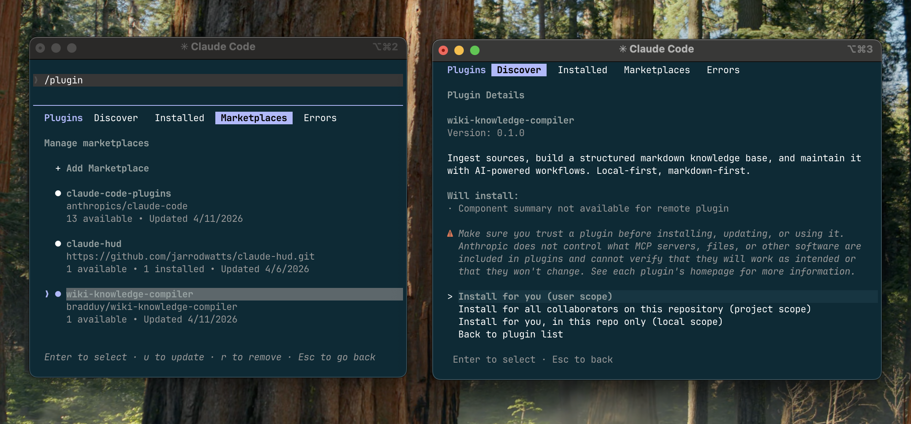

<h1 align="center">Wiki Knowledge Compiler</h1>

<p align="center">
  <em>Biến tài liệu của bạn thành kho kiến thức cá nhân — được hỗ trợ bởi AI, lưu trữ dưới dạng file đơn giản.</em>
</p>

<p align="center">
  <a href="https://github.com/bradduy/wiki-knowledge-compiler/blob/main/LICENSE"></a>
  <a href="https://github.com/bradduy/wiki-knowledge-compiler"></a>
  <a href="https://obsidian.md"></a>
  
</p>

<p align="center">
  
</p>

<p align="center">
  
</p>

## Mục lục

- [Cập nhật mới](#-cập-nhật-mới)
- [Tính năng](#-tính-năng)
- [Ngôn ngữ](#-ngôn-ngữ)
- [Bắt đầu nhanh](#-bắt-đầu-nhanh)
- [Sử dụng](#-sử-dụng)
  - [Thêm tài liệu](#-thêm-tài-liệu)
  - [Ví dụ: Từ tài liệu đến kiến thức](#-ví-dụ-từ-tài-liệu-đến-kiến-thức)
- [Đồ thị tri thức](#-đồ-thị-tri-thức)
- [Độ tin cậy & Theo dõi thông minh](#-độ-tin-cậy--theo-dõi-thông-minh)
- [Duyệt wiki bằng Obsidian](#-duyệt-wiki-bằng-obsidian)
- [Cách thiết lập hoạt động](#%EF%B8%8F-cách-thiết-lập-hoạt-động)
- [Các cách cài đặt khác](#-các-cách-cài-đặt-khác)
- [Đóng góp](#-đóng-góp)
- [Giấy phép](#-giấy-phép)

---

## 🆕 Cập nhật mới

### v2.0.0 — Đồ thị tri thức, chấm điểm tin cậy, và quan hệ phân loại
- 🧠 **Đồ thị tri thức** — Mỗi lần nhập liệu trích xuất thực thể có tên (người, dự án, công nghệ, quyết định) và kết nối chúng bằng quan hệ phân loại trong `.data/entities/`.
- 🔗 **Quan hệ phân loại** — Các khái niệm liên kết với nhau có ý nghĩa: `extends`, `contradicts`, `supersedes`, `depends-on`, `generalizes`, `component-of`.
- 📊 **Chấm điểm tin cậy** — Mỗi trang mang mức `confidence` (`high`/`medium`/`low`), ngày `verified`, và tóm tắt theo dõi `authority` của nguồn (`primary`/`secondary`/`commentary`).
- 🔄 **Thay thế** — Khi thông tin mới thay cũ, các trang được liên kết bằng `supersedes`/`superseded_by` — không xóa gì, lịch sử có thể truy vết.
- 🕸️ **Truy vấn theo đồ thị** — `/wiki` giờ duyệt quan hệ thực thể song song với tìm kiếm từ khóa/ngữ nghĩa để tìm kết nối mà tìm kiếm văn bản bỏ lỡ.
- ⚡ **Phát hiện mâu thuẫn** — Khi các nguồn không đồng ý, cả hai phía được đánh dấu và liên kết tự động.

### v1.x — Nền tảng
- 📅 **Cập nhật theo lịch** — `/wiki-schedule` tự chạy `/wiki-update` theo lịch cron qua remote agent.
- 🔀 **Nhập liệu hỗn hợp** — `/wiki-ingest` chấp nhận file + URL trong một lệnh duy nhất.
- 🔄 **Tự nhập khi cập nhật** — `/wiki-update` phát hiện và nhập file mới trong `raw/`.
- 📝 **Lệnh đơn giản hơn** — `/wiki-query` đổi tên thành `/wiki`.
- 📁 **Cấu trúc phẳng** — Loại bỏ thư mục `knowledge-base/`; `raw/` và `wiki/` nằm ngay gốc dự án.
- 📥 **Nhập hàng loạt** — Thư mục, nhiều file, và glob pattern.
- 🔍 **Tầng tìm kiếm** — Grep cho dự án nhỏ, qmd cho vừa/lớn.
- 🔮 **Tích hợp Obsidian** — Tự cài và thiết lập trong `/wiki-setup`.
- ⚙️ **Tự cài đa nền tảng** — Node.js, qmd, Obsidian trên macOS, Linux, và Windows.

---

## ✨ Tính năng

| Tính năng | Mô tả |
|-----------|-------|
| **Đồ thị tri thức** | Trích xuất người, dự án, công nghệ, quyết định thành thực thể kết nối |
| **Quan hệ phân loại** | Khái niệm và thực thể liên kết có ý nghĩa ngữ nghĩa (`extends`, `contradicts`, `depends-on`) |
| **Theo dõi tin cậy** | Mỗi trang được đánh giá `high`/`medium`/`low` kèm ngày xác minh |
| **Thẩm quyền nguồn** | Tóm tắt gắn nhãn `primary`, `secondary`, hoặc `commentary` |
| **Phát hiện mâu thuẫn** | Các tuyên bố mâu thuẫn được đánh dấu và liên kết tự động |
| **Thay thế** | Tuyên bố cũ liên kết đến nội dung thay thế, không bị xóa âm thầm |
| **Truy vấn theo đồ thị** | `/wiki` duyệt quan hệ thực thể, không chỉ từ khóa |
| **Nhập đa định dạng** | File, thư mục, URL, glob pattern, văn bản dán |
| **Tóm tắt tự động** | Tóm tắt một trang cho mỗi nguồn kèm điểm chính |
| **Trích xuất khái niệm** | 3-10 khái niệm nguyên tử cho mỗi nguồn, tự loại trùng |
| **Tìm kiếm thông minh** | Grep (nhỏ), tìm kiếm lai qmd (vừa), qmd MCP (lớn) |
| **Cập nhật theo lịch** | Tự nhập theo cron qua remote agent |
| **Tích hợp Obsidian** | Duyệt đồ thị trực quan, backlink, đồng bộ trực tiếp |
| **100% offline** | File markdown thuần, không cloud, không database |
| **Đa nền tảng** | macOS, Linux, Windows với tự cài |

---

## 🌐 Ngôn ngữ

<p align="center">
  <a href="./README.md">🇬🇧 English</a> &nbsp;·&nbsp;
  🇻🇳 <strong>Tiếng Việt</strong> &nbsp;·&nbsp;
  <a href="./README_CN.md">🇨🇳 简体中文</a> &nbsp;·&nbsp;
  <a href="./README_KR.md">🇰🇷 한국어</a> &nbsp;·&nbsp;
  <a href="./README_JP.md">🇯🇵 日本語</a> &nbsp;·&nbsp;
  <a href="./README_DE.md">🇩🇪 Deutsch</a> &nbsp;·&nbsp;
  <a href="./README_FR.md">🇫🇷 Français</a> &nbsp;·&nbsp;
  <a href="./README_RU.md">🇷🇺 Русский</a>
</p>

---

## 🚀 Bắt đầu nhanh

Ba bước. Mọi thứ được cài đặt tự động — bạn không cần tự thiết lập gì cả.

**Bước 1 — Cài plugin:**
```
/plugin marketplace add bradduy/wiki-knowledge-compiler
```
Sau khi thêm, cấu hình trong marketplace:
1. Chạy `/plugin` → chọn tab **Marketplace**
2. Tìm **wiki-knowledge-compiler** và mở ra
3. Nhấn **Enable** và chọn scope — chọn thư mục dự án bạn muốn đặt wiki
4. Xác nhận — bước này cấp quyền cho plugin tạo file và chạy lệnh trong thư mục đó

<p align="center">
  
</p>

**Bước 2 — Chạy thiết lập:**
```
/wiki-setup
```
Chọn quy mô dự án (nhỏ, vừa, hoặc lớn). Plugin lo phần còn lại — cài các công cụ cần thiết, tạo thư mục wiki, và còn đề nghị cài [Obsidian](https://obsidian.md) để bạn duyệt wiki trực quan.

<p align="center">
  
</p>

**Bước 3 — Thêm tài liệu đầu tiên:**
```
/wiki-ingest ~/Documents/my-article.md
```

Xong. Wiki của bạn đã sẵn sàng.

---

## 🎯 Sử dụng

Mỗi lệnh sẽ gợi ý bước tiếp theo, nên bạn luôn biết phải làm gì.

| Lệnh | Chức năng |
|---------|-------------|
| `/wiki-setup` | ⚙️ Thiết lập một lần (tự cài đặt mọi thứ cho bạn) |
| `/wiki-ingest` | 📥 Thêm tài liệu — một file, cả thư mục, hoặc một URL |
| `/wiki` | 🔍 Đặt câu hỏi, nhận câu trả lời kèm nguồn |
| `/wiki-insights` | ✨ Tìm các mẫu hình và mối liên hệ giữa các nguồn |
| `/wiki-update` | 🔄 Đồng bộ wiki (nhập file mới trong raw/ + làm mới mục lục) |
| `/wiki-schedule` | 📅 Lên lịch tự chạy /wiki-update |

**Thứ tự khuyên dùng:** `/wiki-setup` → `/wiki-ingest` → `/wiki` → `/wiki-insights` → `/wiki-update` → `/wiki-schedule`

### 📥 Thêm tài liệu

Bạn có thể thêm tài liệu bằng nhiều cách:

```bash
# Một file
/wiki-ingest ~/Documents/article.md

# Cả một thư mục (quét toàn bộ bên trong)
/wiki-ingest ~/Documents/research/

# Nhiều file cùng lúc
/wiki-ingest ~/notes/meeting1.md ~/notes/meeting2.md

# Tất cả PDF trong một thư mục
/wiki-ingest ~/papers/*.pdf

# Một URL
/wiki-ingest https://example.com/interesting-article

# Hoặc dán trực tiếp nội dung sau lệnh
```

Với thư mục và nhiều file, plugin sẽ hiển thị tiến trình khi xử lý từng file.

### 🧪 Ví dụ: Từ tài liệu đến kiến thức

Giả sử bạn thêm một bài viết về biến đổi khí hậu:

```
/wiki-ingest ~/Articles/ipcc-summary-2023.md
```

Plugin sẽ tạo ra:

| Nội dung | Mô tả |
|------|------------|
| **Tóm tắt** | Tổng quan một trang về bài viết kèm đánh giá độ tin cậy |
| **Khái niệm** | Các trang cho ý tưởng chính như "ngân sách carbon" và "điểm tới hạn" |
| **Thực thể** | Các nút cho những thứ cụ thể — "IPCC", "Hiệp định Paris", "TS. Smith" |
| **Trang chủ đề** | Trang "khoa học khí hậu" liên kết mọi thứ lại với nhau |

Thêm bài viết thứ hai về chính sách năng lượng. Plugin nhận ra cả hai nguồn đều đề cập đến ngân sách carbon và tự động liên kết — các khái niệm có quan hệ phân loại (`mở rộng`, `mâu thuẫn`, `phụ thuộc`), và các thực thể kết nối xuyên nguồn.

Khi bạn hỏi:
```
/wiki How do carbon budgets affect energy policy?
```

Plugin không chỉ tìm theo từ khóa. Nó đi dọc **đồ thị tri thức** — bắt đầu từ khái niệm "ngân sách carbon", theo các mối quan hệ đến thực thể và chủ đề liên quan — và tìm ra các kết nối mà tìm kiếm từ khóa bỏ lỡ. Bạn nhận được câu trả lời rút từ **cả hai** nguồn, kèm liên kết đến chính xác nơi mỗi thông tin xuất phát.

---

## 🧠 Đồ thị tri thức

Mỗi tài liệu bạn thêm không chỉ tạo trang — nó xây dựng một **đồ thị tri thức**. Plugin trích xuất các thực thể có tên (người, dự án, công nghệ, quyết định) và kết nối chúng bằng quan hệ phân loại.

```
Redis ──uses──→ Auth Service ──maintained-by──→ Sarah
  │                                              │
  └──depends-on──→ PostgreSQL           owns ←───┘
                        │                Auth Migration
                        └──replaces──→ MySQL
```

Khi bạn hỏi "tác động của việc nâng cấp Redis là gì?", plugin đi ra ngoài từ Redis qua các cạnh `uses`, `depends-on`, `maintained-by` — tìm mọi dịch vụ, người, và quyết định liên quan.

**Những gì được tự động trích xuất:**

| Loại thực thể | Ví dụ |
|-------------|---------|
| Người | "Sarah Chen", "Andrej Karpathy" |
| Dự án | "Auth Migration", "API Redesign" |
| Công nghệ | "Redis", "PostgreSQL", "Kubernetes" |
| Thư viện | "React", "PyTorch", "Express" |
| Quyết định | "Chuyển sang PostgreSQL", "Dùng microservices" |
| Tổ chức | "Platform Team", "Anthropic" |

---

## 📊 Độ tin cậy & Theo dõi thông minh

Không phải kiến thức nào cũng đáng tin như nhau. Mỗi trang trong wiki mang metadata giúp bạn đánh giá:

- **Độ tin cậy** — `high`, `medium`, hoặc `low` dựa trên số nguồn hỗ trợ
- **Ngày xác minh** — lần cuối nội dung được xác nhận chính xác
- **Thẩm quyền** — nguồn là `primary` (nghiên cứu gốc), `secondary` (tổng hợp), hay `commentary` (ý kiến)
- **Quan hệ phân loại** — kết nối giữa khái niệm có ý nghĩa: `extends`, `contradicts`, `supersedes`, `depends-on`

Khi hai nguồn mâu thuẫn, plugin đánh dấu **mâu thuẫn** và liên kết cả hai phía. Khi thông tin mới thay thế cũ, trang cũ được đánh dấu **superseded** kèm liên kết đến nội dung thay thế.

---

## 🔮 Duyệt wiki bằng Obsidian

Trong quá trình thiết lập, bạn sẽ được hỏi có muốn dùng [Obsidian](https://obsidian.md) không — một ứng dụng miễn phí để duyệt wiki trực quan. Nó được cài tự động nếu bạn đồng ý.

Mở thư mục dự án trong Obsidian và bạn có:

- 🕸️ **Graph View** — bản đồ trực quan tất cả các trang và cách chúng kết nối
- 🔙 **Backlinks** — nhấn vào bất kỳ trang nào để xem mọi thứ liên kết đến nó
- 🔍 **Search** — tìm bất cứ thứ gì trong toàn bộ wiki
- ⚡ **Đồng bộ trực tiếp** — các trang mới từ `/wiki-ingest` hiện ngay trong Obsidian

Đây là tùy chọn. Wiki của bạn hoạt động hoàn toàn tốt chỉ với các lệnh.

---

## 📁 Những gì được tạo ra

```
your-project/
  📄 raw/           Tài liệu gốc của bạn (không bao giờ bị sửa đổi)
  📚 wiki/          Tất cả trang được tạo (tóm tắt, khái niệm, chủ đề, insights)
  .data/            Dữ liệu nội bộ (ẩn)
```

Không có thư mục bao bọc. `raw/` và `wiki/` nằm ngay trong dự án. Nếu `raw/` đã tồn tại, thiết lập chỉ thêm `wiki/` bên cạnh.

Tất cả file đều là Markdown thuần. Mở bằng bất kỳ trình soạn thảo nào, Obsidian, hoặc VS Code.

---

## 💡 Mẹo hay

- 🌱 **Bắt đầu nhỏ.** Thêm 2–3 nguồn và thử `/wiki` trước khi thêm nhiều hơn.
- 🎯 **Hỏi cụ thể.** "Nguồn X nói gì về Y?" hiệu quả hơn câu hỏi chung chung.
- ✨ **Thử `/wiki-insights`** sau khi thêm nhiều nguồn về cùng một chủ đề — nó tìm ra các mẫu hình bạn có thể bỏ lỡ.
- 🔒 **Nguồn của bạn luôn an toàn.** Plugin không bao giờ thay đổi file gốc của bạn.

---

## ⚙️ Cách thiết lập hoạt động

`/wiki-setup` tự động xử lý mọi thứ dựa trên quy mô dự án của bạn:

| Quy mô | Tìm kiếm | Những gì được cài đặt |
|------|--------|-------------------|
| **Nhỏ** | Tích hợp sẵn | Không cần thêm gì |
| **Vừa** | Tìm kiếm thông minh ([qmd](https://github.com/tobi/qmd)) | Node.js + qmd (tự động cài) |
| **Lớn** | Tìm kiếm nhanh nhất | Node.js + qmd + MCP server (tự động cài và cấu hình) |

Plugin nhận diện hệ điều hành của bạn (macOS, Linux, Windows) và cài đặt mọi thứ bằng phương pháp phù hợp. Nếu có lỗi xảy ra, nó tự chuyển về tìm kiếm tích hợp sẵn — bạn không bao giờ bị kẹt.

---

## 📦 Các cách cài đặt khác

### Từ Claude Code Marketplace (dễ nhất)

```
/plugin marketplace add bradduy/wiki-knowledge-compiler
```
Sau khi thêm, cấu hình trong marketplace:
1. Chạy `/plugin` → chọn tab **Marketplace**
2. Tìm **wiki-knowledge-compiler** và mở ra
3. Nhấn **Enable** và chọn scope — chọn thư mục dự án bạn muốn đặt wiki
4. Xác nhận — bước này cấp quyền cho plugin tạo file và chạy lệnh trong thư mục đó

<p align="center">
  
</p>

### Clone như một dự án độc lập

```bash
git clone https://github.com/bradduy/wiki-knowledge-compiler.git
cd wiki-knowledge-compiler
```

Mở trong Claude Code và chạy `/wiki-setup`.

### Thêm vào dự án hiện có

```bash
git clone https://github.com/bradduy/wiki-knowledge-compiler.git /tmp/wkc
cp -r /tmp/wkc/.claude/ your-project/.claude/
cp -r /tmp/wkc/.claude-plugin/ your-project/.claude-plugin/
cp -r /tmp/wkc/{agents,skills,templates} your-project/
cp /tmp/wkc/CLAUDE.md your-project/CLAUDE.md
cp /tmp/wkc/.data/wiki.config.md your-project/.data/wiki.config.md
bash /tmp/wkc/scripts/init-kb.sh your-project/knowledge-base
rm -rf /tmp/wkc
```

Sau đó chạy `/wiki-setup`.

---

## 📌 Lưu ý thêm

- 📡 **Hoạt động offline.** Mọi thứ nằm trên máy tính của bạn.
- 📄 **File văn bản thuần.** Không cần database hay phần mềm đặc biệt để đọc wiki.
- 📑 **Hỗ trợ PDF.** Bố cục phức tạp (bảng, nhiều cột) có thể không trích xuất hoàn hảo.
- 👤 **Thiết kế cho cá nhân.** Một người dùng.
- 🕐 **Muốn lưu lịch sử phiên bản?** Chạy `git init` trong thư mục knowledge base.

---

## 🤝 Đóng góp

Muốn cải thiện plugin? Xem [hướng dẫn đóng góp](.github/CONTRIBUTING.md) hoặc tạo issue.

## 📄 Giấy phép

MIT
